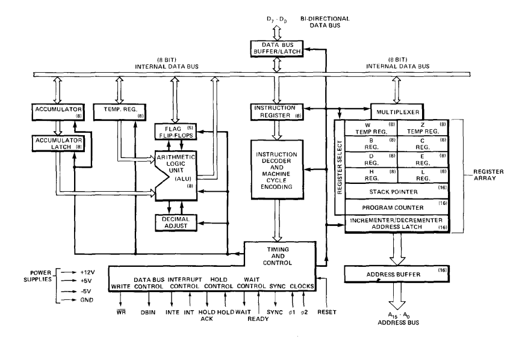

# itl8080
An emulator for the Intel 8080 CPU Instruction Set

# Specs & Mental Logs
### Registers
A static RAM array organised into six 16-bit registers.
It contains:
* Program counter (PC)
* Stack pointer (SP)
* Six 8-bit general purpose registers arranged in pairs, referred to as B, C; D, E; and H, L
* A temporary register pair called W,Z

The PC (program counter) is responsible for holding the memory address of the current program instruction, and is incremented automatically during every instruction fetch.

The SP (stack pointer) is responsible for holding the memory address of the next available stack location in memory, it can be initialised to use any portion of read-write memory as a stack.

When data is "pushed" onto the stack, the SP is decremented; when data is "popped" from the stack, the SP is incremented. Because the stack grows downwards.

The six general purpose registers can be used either as single registers (8-bit) or as register pairs (16-bit).

*The temporary register pair, W,Z is not program addressable and is only used for the internal execution of instructions.*

Eight bit data bytes can be transferred between the internal bus and the register array via the register select multiplexer. Sixteen bit transfers can proceed between the register array and the address latch or the incrementer/decrementer circuit. The address latch receives data from any of the three register pairs and drives the 16 address output buffers (A0-A15), as well as the incrementer/decrementer circuit. The IC/DC circuit receives data from the address latch and sends it to the register array. The 16 bit data can be incremented or decremented or simply transferred between registers.

